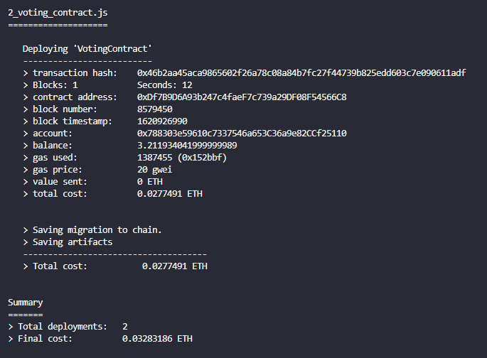
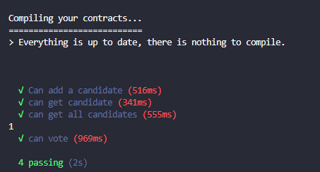

# Voting Contract

### Versions used

```
Truffle v5.3.1 (core: 5.3.1)
Solidity v0.5.16 (solc-js)
Node v12.13.1
Web3.js v1.3.5
```

### Smart Contract deployed to the Rinkeby Test Network

- Contract Address 0xDf7B9D6A93b247c4faeF7c739a29DF08F54566C8

### Brief Description

- A moderator will be able to add candidates to the election
- For an election to start the moderator will have to call the startVoting() function
- Once the election beggins people other than the moderator will be able to vote by the candidates ID
- Users will only be allowed to vote once
- The moderator will be able to stop the election by calling the haltVoting() function (this also can be changed for the election to finish after a certain amount of time)

### Contract info



### Contract tests



<br /> Made by Antonio Salazar. 😎
